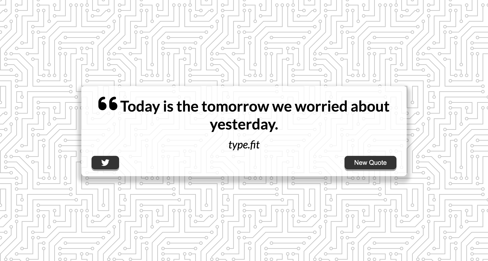

# Quote Generator

A simple web application that generates random quotes. The application is built using HTML, CSS, and JavaScript. It fetches quotes from an external API and displays them in an aesthetically pleasing interface.

## Features

- Displays a random quote from a collection of quotes.
- Responsive and visually appealing design.
- Option to generate a new quote with a click of a button.

## Usage

1. Clone the repository:
    ```sh
    git clone https://github.com/R1shabh-Gupta/quote-generator.git
    ```
2. Open the `index.html` file in your browser to view the application.

## Files

- `index.html`: The main HTML file that structures the web page.
- `style.css`: The CSS file that styles the web page.
- `script.js`: The JavaScript file that handles fetching and displaying quotes.
- `img/`: Directory containing any image assets used in the application.

## Screenshot



## License

This project is licensed under the MIT License. See the [LICENSE](LICENSE) file for more details.